<div align="center">


# trckable

**Peekaboo. Every visit counted.**

Tiny, open-source, self-hosted web analytics that also shows you **which traffic pays**.<br>
One container, a 2 KB script, and revenue attribution for Stripe, Lemon Squeezy, Polar, Paddle and Dodo.

[](CHANGELOG.md)
[](LICENSE)
[](packages/trckable/LICENSE)
[](server/go.mod)
<!--f:badge_tracker-->[](https://trckable.com/docs/benchmarks/)<!--/f-->
<!--f:badge_memory-->[](https://trckable.com/docs/benchmarks/)<!--/f-->

[Quick start](#-quick-start) · [How it compares](#️-how-it-compares) · [Everything it does](#-everything-it-does) · [Gallery](#-gallery) · [Docs](https://trckable.com/docs/) · [Changelog](CHANGELOG.md)

<a href="#-quick-start"></a>&nbsp;<a href="https://trckable.com/#pricing"></a>

<br>

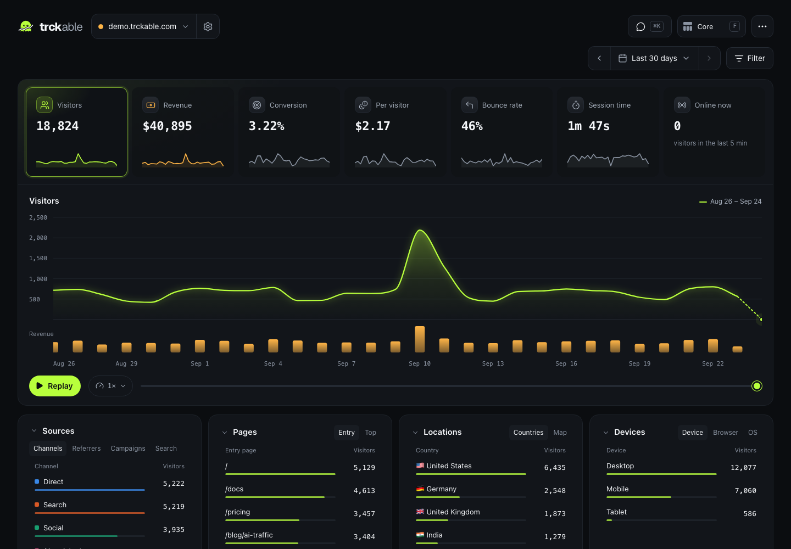

<sub>Core mode on the demo site. Press <kbd>F</kbd> for Full: revenue and conversion on every row, goals, top earners and a live feed.</sub>

<br><br>

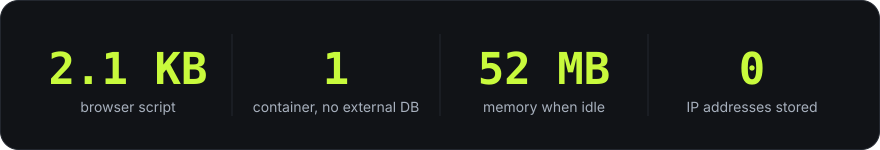

</div>

> **Early preview.** Tracking, the dashboard, revenue for all five providers, Full mode, the MCP server and the self-hosting tools are built and tested. Still to come: live sandbox runs against each payment provider, the in-app assistant, and v1.0.

## ⚡ Quick start

```bash
docker run -d --name trckable -p 8080:8080 -v trckable-data:/data ghcr.io/trckable/trckable
docker logs trckable   # a one-time setup link: open it, create your account, add your site
```

The image is for x86-64 and arm64; pin a version with `ghcr.io/trckable/trckable:0.1.0`. You can also build it yourself: `docker build -t trckable -f deploy/Dockerfile https://github.com/trckable/trckable.git`.

```html
<script defer src="https://stats.yoursite.com/js/tkb_….js"></script>
```

Your site's own script, from Settings → Install: it carries the modules and the privacy settings you chose. The npm package for React and Next.js, where events go through your own domain, is published soon. Every route is in the docs: [install](https://trckable.com/docs/install/) · [platforms](https://trckable.com/docs/install/platforms/) · [revenue](https://trckable.com/docs/revenue/) · [MCP](https://trckable.com/docs/api/mcp/).

## ⚖️ How it compares

The free, self-hostable tools, plus DataFast (paid, hosted only) for script size, all measured the same way. The full tables, sources and caveats: [How it compares](https://trckable.com/docs/compare/).

<p align="center">
  
</p>
<p align="center">
  
</p>

**Where it is not the right pick:** with pageviews only, Plausible CE's script is smaller (1,283 B against <!--f:tracker_core_bytes-->1,583<!--/f--> B). And session replay, heatmaps and A/B tests are out of scope on purpose. If you need those, use Matomo.

## 🧰 Everything it does

Nothing is paid, limited or kept for a hosted edition. The complete list, in words: [Everything it does](https://trckable.com/docs/features/).

<p align="center">
  
  
</p>
<p align="center">
  
  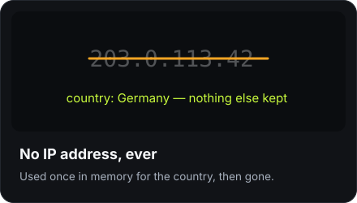
</p>
<p align="center">
  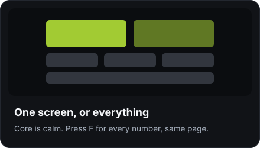
  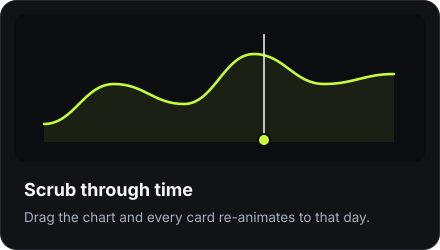
</p>
<p align="center">
  
  
</p>
<p align="center">
  
  
</p>
<p align="center">
  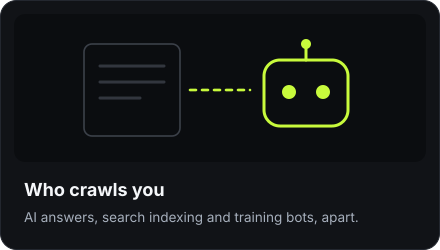
  
</p>
<p align="center">
  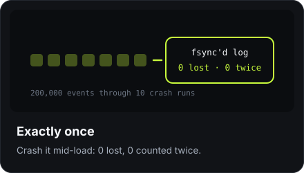
  
</p>
<p align="center">
  
  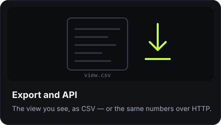
</p>

## 🖼 Gallery

<table>
<tr>
<td width="50%">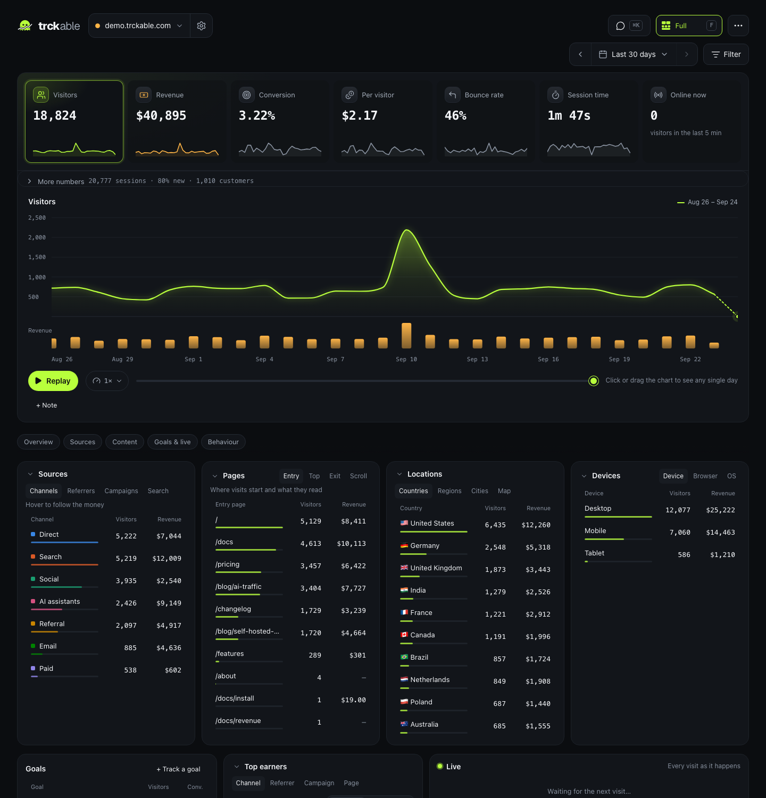<br><sub><b>Full mode.</b> Revenue and conversion on every row.</sub></td>
<td width="50%">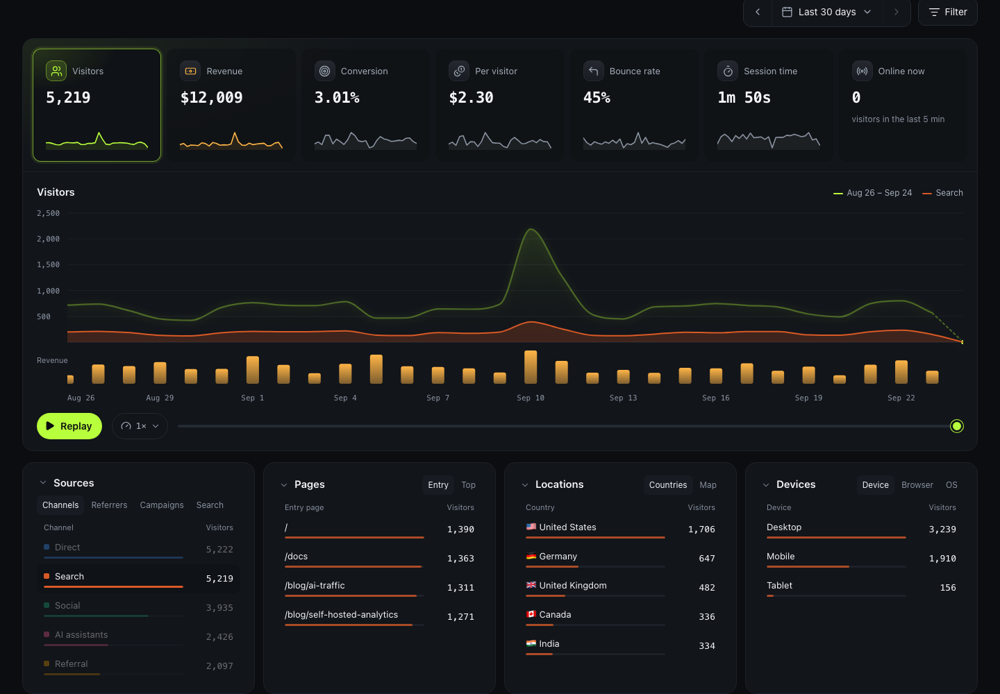<br><sub><b>Money trail.</b> Hover a source, follow its visitors and their money.</sub></td>
</tr>
<tr>
<td>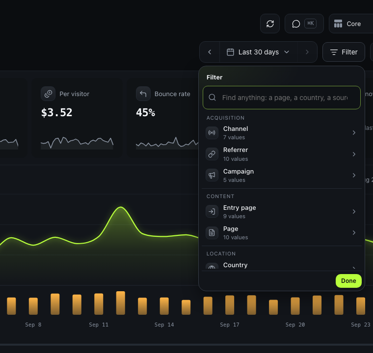<br><sub><b>Filter menu.</b> Every dimension, grouped and searchable; saved views.</sub></td>
<td>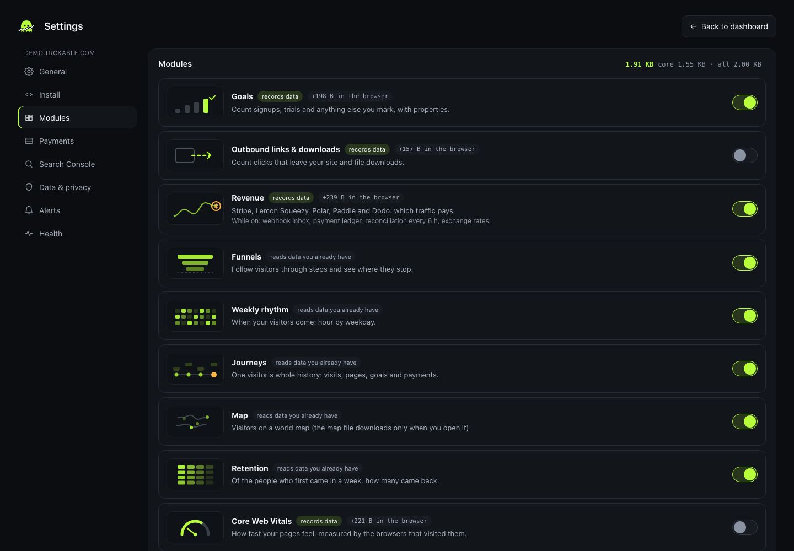<br><sub><b>Modules.</b> Each priced in bytes before you turn it on.</sub></td>
</tr>
<tr>
<td>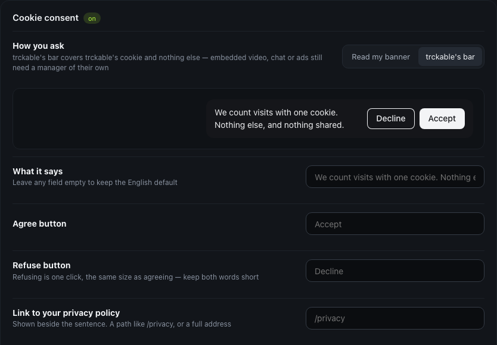<br><sub><b>Cookie consent.</b> Read your banner, or brand trckable's own bar.</sub></td>
<td>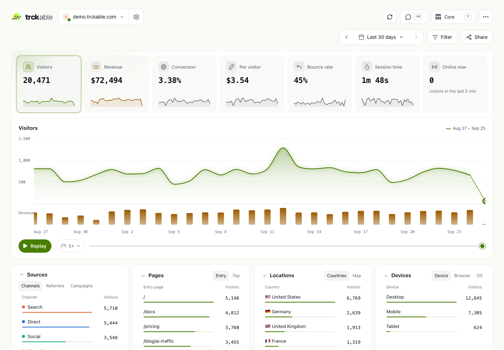<br><sub><b>Light theme.</b> Both themes are built to WCAG 2.1 AA and checked with axe-core.</sub></td>
</tr>
</table>

## 🏗 How it's built

<p align="center">
  
</p>

Go, embedded DuckDB and SQLite, React with an in-house SVG chart kit. Every event is fsynced before it's acknowledged, every webhook is stored raw before it's processed, and both replay exactly once. How each number was measured: [By the numbers](https://trckable.com/docs/benchmarks/).

## 🗺 Roadmap

- [x] Tracking, dashboard (Core and Full), revenue for five providers, MCP server
- [x] Self-hosting tools: alerts, encrypted backups, imports, 2FA, share links, WCAG 2.1 AA (checked with axe-core before a release)
- [x] npm package with `init` / `doctor` / `mcp` (built and tested; published with the first release)
- [ ] Live sandbox runs against each payment provider
- [ ] Ask trckable: an optional in-app assistant on the same read-only tools, with your own AI key
- [ ] Public v1.0: Railway template, releases, public demo

## 🤝 Contributing

Contributions are welcome: how to build, test and send a change is in [CONTRIBUTING.md](CONTRIBUTING.md). Found a security problem? Please report it privately, as [SECURITY.md](SECURITY.md) explains.

## License

Server and dashboard [AGPL-3.0](LICENSE) · tracker and the `trckable` npm package [MIT](packages/trckable/LICENSE) · geolocation by [DB-IP](https://db-ip.com) (CC BY 4.0)
