<div align="center">


# trckable

**The only analytics you need. Private, free and open source.**

**Free and open source (AGPL-3.0)**, self-hosted web analytics that also shows you **which traffic pays**.<br>
One container, a 2 KB script, and revenue attribution for Stripe, Lemon Squeezy, Polar, Paddle and Dodo.<br>
Self-host it for free, or let [trckable Cloud](https://cloud.trckable.com) run it for you.

[](CHANGELOG.md)
[](LICENSE)
[](packages/trckable/LICENSE)
[](server/go.mod) <!--f:badge_tracker--><a href="https://docs.trckable.com/benchmarks/"></a><!--/f--> <!--f:badge_memory--><a href="https://docs.trckable.com/benchmarks/"></a><!--/f-->

[Quick start](#-quick-start) · [How it compares](#️-how-it-compares) · [Everything it does](#-everything-it-does) · [Gallery](#-gallery) · [Docs](https://docs.trckable.com/) · [Changelog](CHANGELOG.md)

<a href="#-quick-start"></a>

<br>

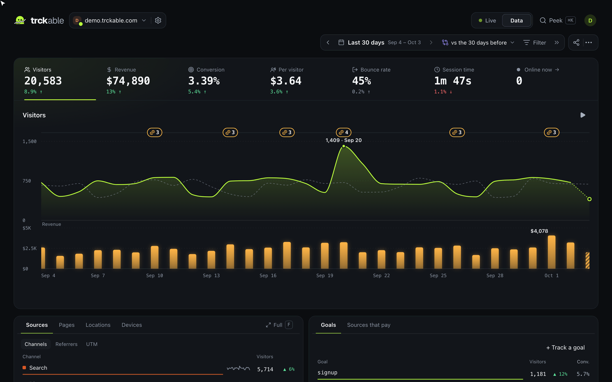

<sub>The demo site, recorded from the real dashboard: the comparison, the day under the pointer, Share, the money trail from Search, Full (<kbd>F</kbd>) and Replay.</sub>

<br><br>

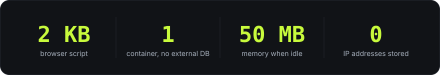

</div>

> **Early preview.** Tracking, the dashboard, revenue for all five providers, Full mode, the MCP server and the self-hosting tools are built and tested. Still to come: live sandbox runs against each payment provider, the in-app assistant, and v1.0.

## 🧭 Two ways to use it

| | Self-host | trckable Cloud |
|---|---|---|
| Who runs it | You, on your own server: one container | We do, at [cloud.trckable.com](https://cloud.trckable.com) |
| Price | Free and open source (AGPL-3.0), every feature | 14-day free trial, then a plan that fits your traffic |
| Updates and backups | Yours | Ours |
| Start | The quick start below | [Sign up](https://cloud.trckable.com) |

Same product either way, and the same 2 KB script.

## ⚡ Quick start

```bash
docker run -d --name trckable -p 8080:8080 -v trckable-data:/data ghcr.io/trckable/trckable
docker logs trckable   # a one-time setup link: open it, create your account, add your site
```

The image is for x86-64 and arm64; pin a [release](https://github.com/trckable/trckable/releases) with its tag, `ghcr.io/trckable/trckable:<version>`. You can also build it yourself: `docker build -t trckable -f deploy/Dockerfile https://github.com/trckable/trckable.git`.

The container runs as an unprivileged user (65532), not root. A new Docker volume just works: it takes `/data`'s owner from the image. Two cases need one step. A volume an older image filled as root, or a bind-mounted folder Docker created as root, needs its owner changed once: `docker run --rm -v trckable-data:/data busybox chown -R 65532:65532 /data` (for a bind mount, `chown -R 65532:65532` on that folder). On Railway, which mounts the volume as root, set `RAILWAY_RUN_UID=0` on the service. If the data folder is not writable, trckable says so at start and prints the fix for your case. Behind a reverse proxy (Caddy, nginx, Traefik) also set `TRCKABLE_TRUST_PROXY=xff`, or `header:X-Real-IP`, so the sign-in limits and the country lookup see each visitor and not the proxy; `npx trckable doctor` checks it.

```html
<script
  defer
  data-site="tkb_a1b2c3d4"
  data-domain="example.com"
  src="https://stats.example.com/js/tkb_a1b2c3d4.js">
</script>
```

Your site's own script, from Settings → Install: it carries the modules and the privacy settings you chose. Or `npm i trckable` for React and Next.js, where events go through your own domain. Every route is in the docs: [install](https://docs.trckable.com/install/) · [platforms](https://docs.trckable.com/install/platforms/) · [revenue](https://docs.trckable.com/revenue/) · [MCP](https://docs.trckable.com/api/mcp/).

## ⚖️ How it compares

The free, self-hostable tools, plus DataFast (paid, hosted only) for script size, all measured the same way. The full tables, sources and caveats: [How it compares](https://docs.trckable.com/compare/).

<p align="center">
  
</p>
<p align="center">
  
</p>

**Where it is not the right pick:** with pageviews only, Plausible CE's script is smaller (1,283 B against <!--f:tracker_core_bytes-->1,596<!--/f--> B). And session replay, heatmaps and A/B tests are out of scope on purpose. If you need those, use Matomo.

## 🧰 Everything it does

Nothing is paid, limited or held back. The complete list, in words: [Everything it does](https://docs.trckable.com/features/).

<p align="center">
  
  
</p>
<p align="center">
  
  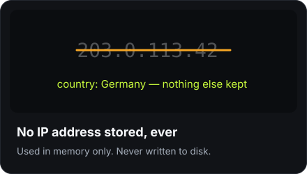
</p>
<p align="center">
  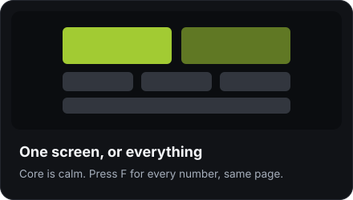
  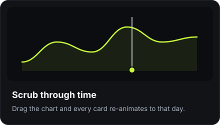
</p>
<p align="center">
  
  
</p>
<p align="center">
  
  
</p>
<p align="center">
  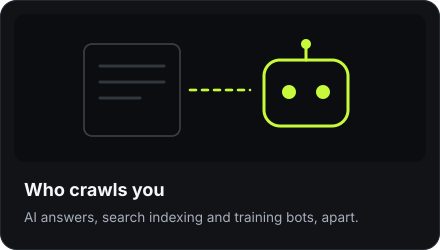
  
</p>
<p align="center">
  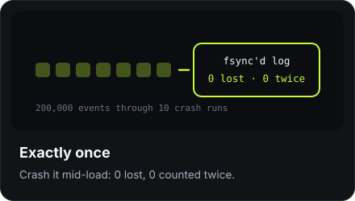
  
</p>
<p align="center">
  
  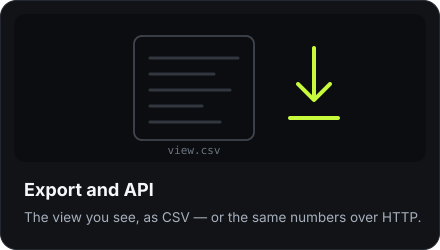
</p>

### When your server is down

A visitor's browser keeps what it could not send, up to 24 hours and 200 events, and sends it when your server answers again: the visits made meanwhile are counted once, on the day they happened. The server takes events up to 25 hours old; the browser's queue is the only copy until then, so a visitor who clears their site data in that time takes it with them. A visitor counted without a cookie has nothing stored in the browser, so what could not be sent is kept in memory and sent again for as long as the page is open: if they close the page first, those events are lost. A visit that was cut in two by the outage is stored as two visits, with every page view counted.

### Little things you notice

- **Live count in the tab**: "● 8 · trckable" in the browser tab and a dot on its icon while anyone is online. Off with one switch.
- **Cha-ching**: a coin toast when a sale arrives, over any view, with an optional chime. Browser notices for a first sale from a new source, a spike or tracking stopping are opt-in, and asked for only from a button.
- **Sparklines** on the top Sources and Pages, **vs usual** under Visitors ("+18% vs usual", against the same weekday) and **where the month is heading** ("≈ 41k by 31 Oct").
- **Site icons** beside referrers, fetched by your server once and kept there: your visitors' browsers never ask a third party.
- **Milestones** celebrate with a short ghost hop and a card ready to share. The cards that come up by themselves (a milestone, the one thing today, a nudge) are one design: what it is, when, its figure counting up, where it came from, a small chart of the moment, and a deck you turn with ← → or a swipe.
- **Install on your phone**: the dashboard is an installable app. On Android and desktop Chrome or Edge, open the avatar menu and choose **Install app**. On an iPhone or iPad, tap Share in Safari, then **Add to Home Screen**. It opens in its own window with the ghost icon. Only the page's own files are kept for an offline start; your numbers, the API and shared pages always come from your server, never from a copy in the browser.
- **Smooth theme switch**: a short crossfade, nothing redrawn, and the saved theme is on before the first frame.

### Keyboard shortcuts

Press `?` in the dashboard for the list; every key can be changed there and follows your account.

| Key | What it does |
|---|---|
| `?` | The shortcuts list |
| `⌘K` / `Ctrl K` | Peek, your own AI |
| `F` | Core ↔ Full |
| `L` | Live ↔ Data |
| `A` | Create a goal, funnel or note |
| `S` | Switch site |
| `U` | Your menu |
| `,` | Settings |
| `/` | Filter |
| `Shift S` | Share |
| `R` | Replay, play or pause |
| `T` `Y` `7` `3` `9` `1` `W` `M` `N` | Today, Yesterday, Last 7 / 30 / 90 days, 12 months, This week, This month, Now |
| `←` `→` | Step the period back or forward |
| `C` | Compare with the period before |
| `Esc` | Close what is open |

## 🖼 Gallery

<table>
<tr>
<td width="50%">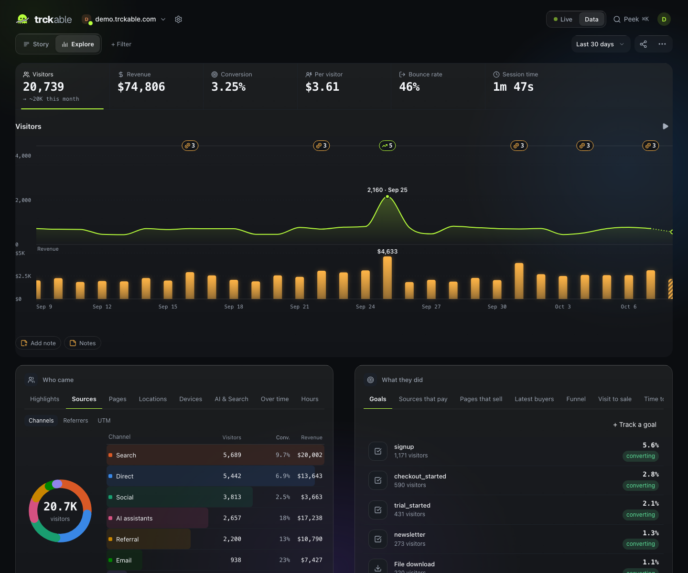<br><sub><b>Full mode.</b> Two tabbed cards; revenue and conversion on every row, highlights, the AI assistants, the pages that sell and the latest buyers.</sub></td>
<td width="50%">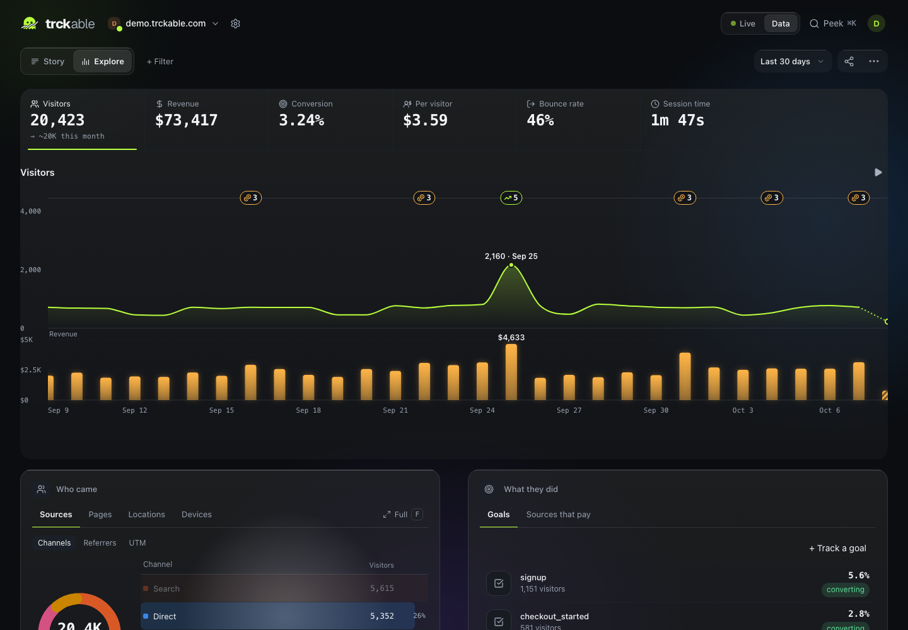<br><sub><b>Money trail.</b> Hover a source, follow its visitors and their money.</sub></td>
</tr>
<tr>
<td>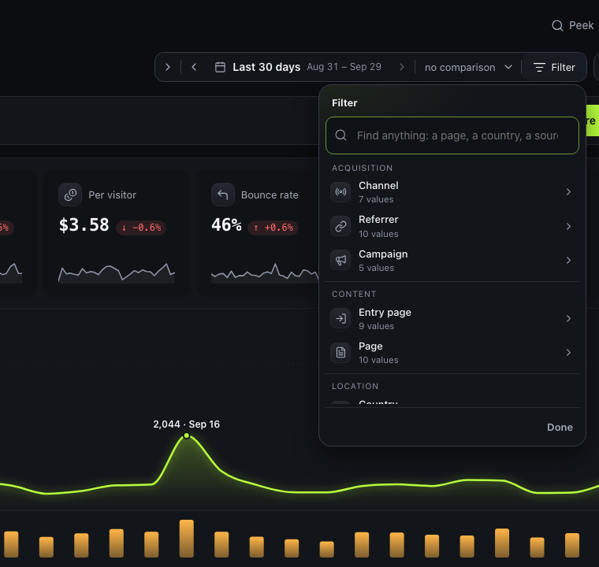<br><sub><b>Filter menu.</b> One search across every dimension; pick several without closing it.</sub></td>
<td>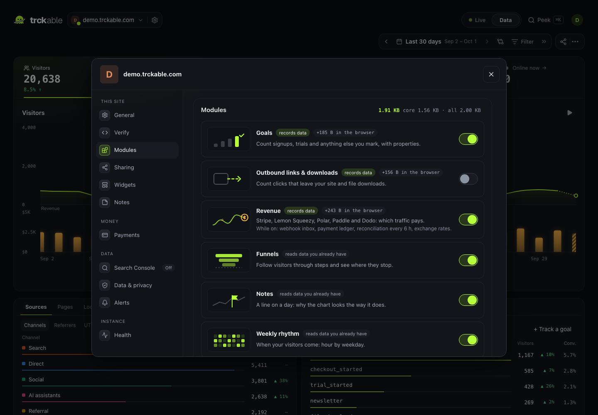<br><sub><b>Modules.</b> Each priced in bytes before you turn it on.</sub></td>
</tr>
<tr>
<td>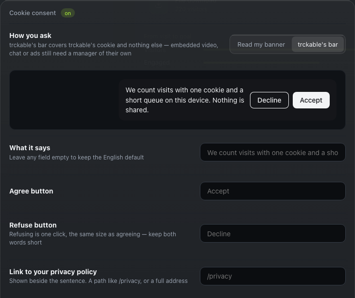<br><sub><b>Cookie consent.</b> Read your banner, or brand trckable's own bar.</sub></td>
<td>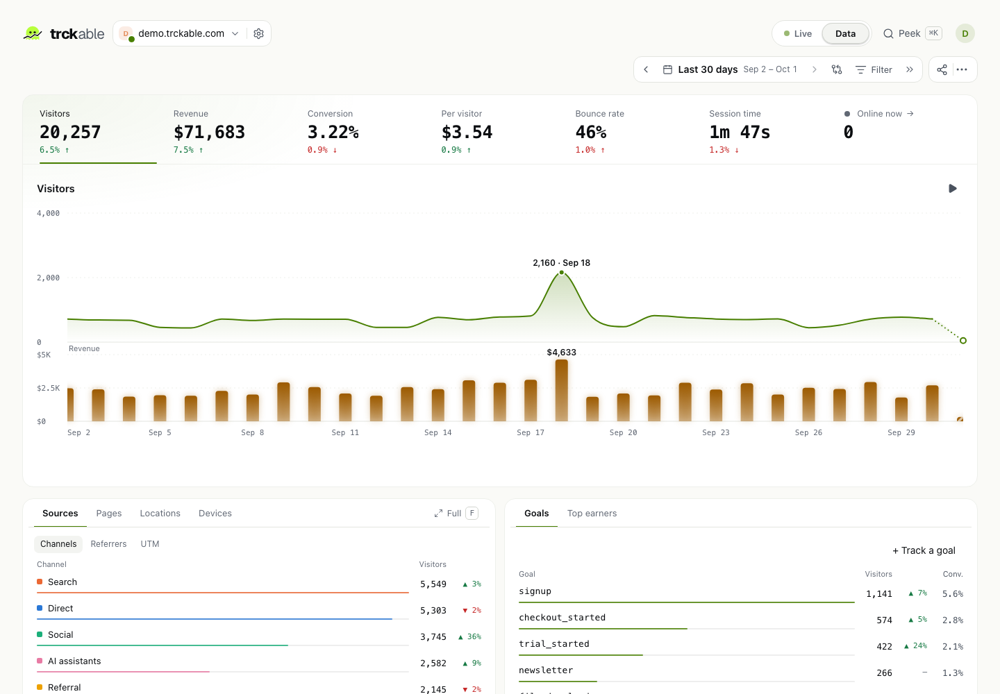<br><sub><b>Light theme.</b> Both themes are built to WCAG 2.1 AA and checked with axe-core.</sub></td>
</tr>
<tr>
<td>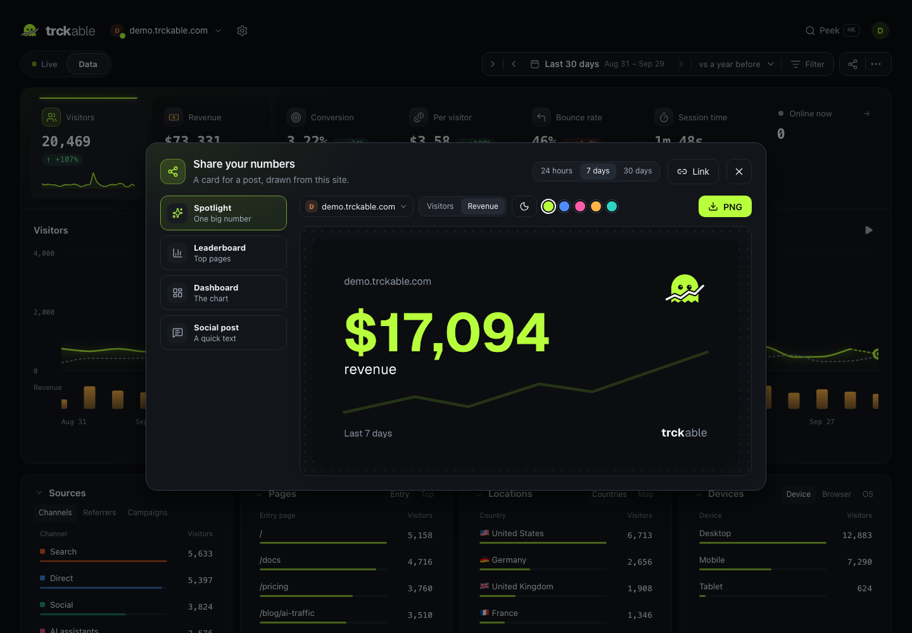<br><sub><b>Share card.</b> Your numbers as a picture or a GIF, made in the browser. Nothing is uploaded.</sub></td>
<td>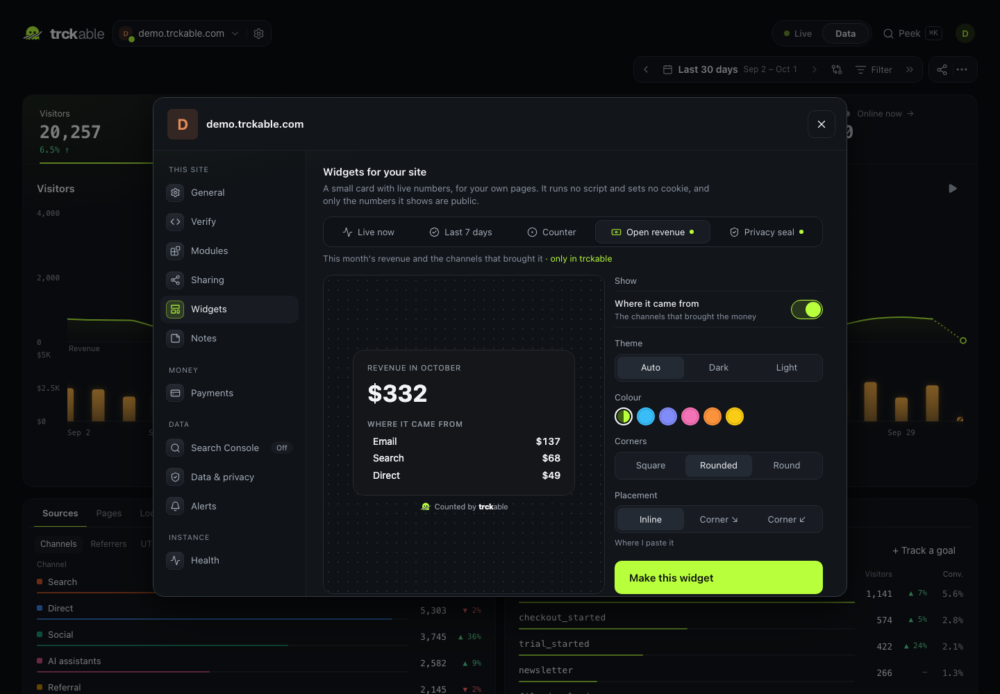<br><sub><b>Widgets.</b> Live numbers for your own pages, with no script and no cookie.</sub></td>
</tr>
</table>

## 🏗 How it's built

<p align="center">
  
</p>

Go, embedded DuckDB and SQLite, React with an in-house SVG chart kit. Every event is fsynced before it's acknowledged, every webhook is stored raw before it's processed, and both replay exactly once. How each number was measured: [By the numbers](https://docs.trckable.com/benchmarks/).

## 🗺 Roadmap

- [x] Tracking, dashboard (Live, Core and Full), revenue for five providers, MCP server
- [x] Self-hosting tools: alerts (a new site starts with the weekly report, with the week's findings, and "tracking stopped" on, by email to the owner or to the webhook already in use; every email has a link that stops it), encrypted backups (copied to your own bucket, restored straight from it), imports, 2FA, read-only share links (public or password, revenue and notes on or off, an end date, embeddable, copyable again, revocable), WCAG 2.1 AA (axe-core on the dashboard's main screens, both themes, three browsers, in CI)
- [x] npm package [`trckable`](https://www.npmjs.com/package/trckable) with `init` / `doctor` / `mcp`, published from CI with provenance
- [ ] Live sandbox runs against each payment provider
- [ ] Peek: an optional in-app assistant on the same read-only tools, with your own AI key
- [ ] A mobile app (iOS and Android): connect it to your own server and see your visitors, sources and sales on your phone
- [x] Releases: one tag publishes the image (x86-64, arm64), the npm package and the GitHub release
- [ ] Public v1.0: a one-click deploy template, a public demo

## 🤝 Contributing

Contributions are welcome: how to build, test and send a change is in [CONTRIBUTING.md](CONTRIBUTING.md). Found a security problem? Please report it privately, as [SECURITY.md](SECURITY.md) explains.

## License

Server and dashboard [AGPL-3.0](LICENSE) · tracker and the `trckable` npm package [MIT](packages/trckable/LICENSE) · geolocation by [DB-IP](https://db-ip.com) (CC BY 4.0)

The name trckable and the logo are not part of those licenses: a fork is welcome, under its own name. See [TRADEMARKS.md](TRADEMARKS.md).
